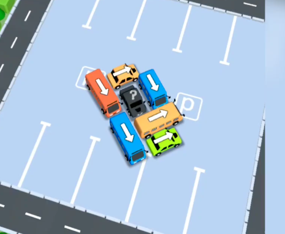

### ElkaGame
## Описание проекта

# Жанр: 
Игра в жанре логической голомоломки с мультяшной графикой и элементами сортировки.

# Сетинг:
Парковка, автовокзал.

# Визуальный стиль: 
3D с мультяшной графикой.

# Основная механика: 
Выбор сводобного для езды автомобиля и сопоставления отправляемых автомобилей с цветом пасажиров.

# Управление: 
Реализовано через тап (клик) по автомобилю. Игрок оценивает ситуацию - доступные автомобили, их направление и цвет ожидающих пасажиров, принимает решение об отправке ее на парковку.

# Дополнительные механики:
Направление движение автомобиля - автомобили могут двигатся только в указаном направлении. (Добавление элемента головоломки - не просто выбор цвета но и возможность выезда с парковки).
Вместимость автомобиля - в автомобиль может сесть разное количество пасажиров.
Система "спрос-предложение" - люди в очереди имеют цвет соответствующий цвету машины (Механика - совпадания по цвету).
Цикл "прибытие - посадка - отбытие" - машина прибывает к очереди людей, наполняется пасажирами, полная машина уезжает.

# Притягательный аспект:
Понятная логика игры - простая головоломка по цвету.
Эфект чистоты и порядка - уменьшение очереди дает ощущения контроля и наведению порядка.
Визуальная ясность - цветовая палитра и стрелки делают гейплей интуитивно понятным с первого взгляда.
Ритм - машины приезжают, наполняются и уезжают - это затягивает.

# Риски
Монотоность - нехватка событий и препятствий.
